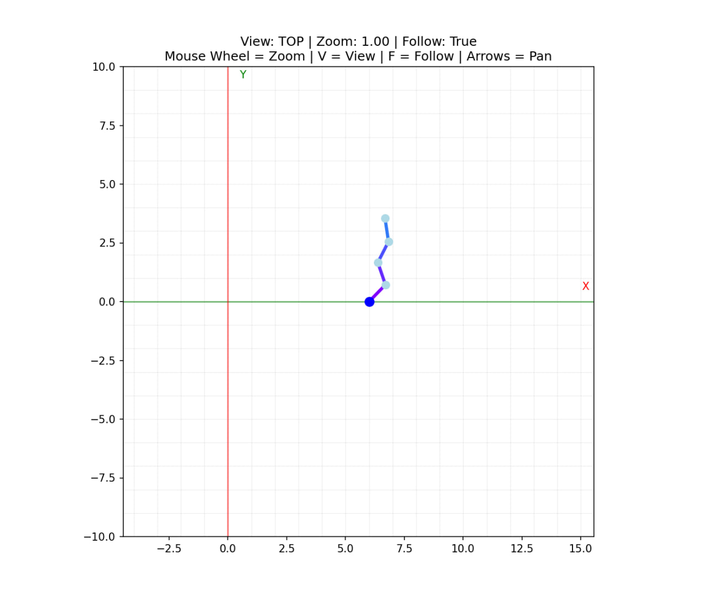
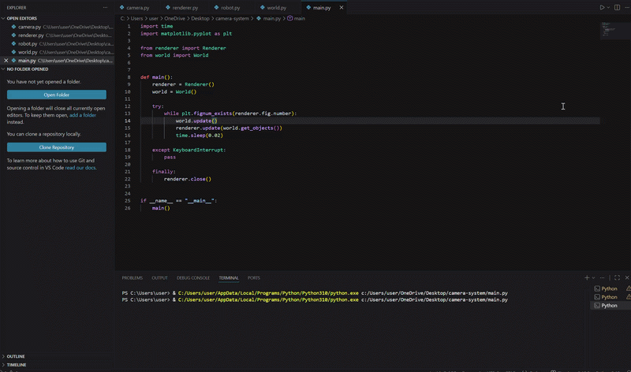

#  Add Camera System

A flexible camera system for a 2D renderer architecture built with Python and Matplotlib.

---
# students: Nagham Sleman 476937  Salam Ali 503263

## Features

* Top view projection
* Left view projection
* Smooth camera following
* Camera zoom in/out
* Camera panning
* World-to-screen transformation
* Screen-to-world transformation
* Dynamic grid rendering
* Modular renderer architecture

---

## Controls

| Key         | Action               |
| ----------- | -------------------- |
| Mouse Wheel | Zoom in/out          |
| Arrow Keys  | Pan camera           |
| F           | Toggle camera follow |
| V           | Switch camera view   |

---

## Project Structure

```text
camera-system/
│
├── camera.py
├── renderer.py
├── robot.py
├── world.py
│
├── docs/
│   ├── ticket20.jpg
│   └── ticket20.gif
│
├── main.py
├── README.md
└── requirements.txt
```

---

## Architecture Diagram



## Demo GIF



## Coordinate Systems

### World Space

3D coordinates inside the simulation world.

**Example:**

```text
(100, 50, 20)
```

### Screen Space

2D coordinates rendered on the screen.

**Example:**

```text
(500, 300)
```

---

## Projection Modes

### Top View

Projects:

```text
(X, Y)
```

The Z-axis is hidden.

### Left View

Projects:

```text
(X, Z)
```

The Y-axis is hidden.

---

## Camera Features

* Object following
* Smooth movement
* Zoom scaling
* Coordinate transformations
* Camera panning
* Dynamic grid rendering
* View switching

---

## Installation

```bash
pip install -r requirements.txt
```

---

## Run

```bash
python main.py
```

---

## Requirements

* Python 3.10+
* NumPy
* Matplotlib
